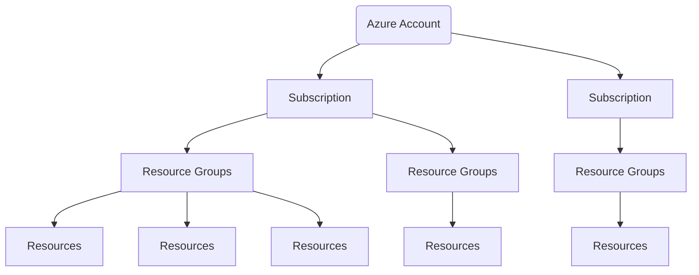

# Introdução a contas do Azure

Para criar e usar os serviços do Azure, você precisa de uma assinatura (subscription) do Azure. Ao trabalhar com os próprios aplicativos e as próprias necessidades de negócios, você precisará criar uma conta do Azure e uma assinatura será criada para você. Depois de criar uma conta do Azure, você poderá criar assinaturas adicionais.

Por exemplo: a empresa pode usar apenas uma conta do Azure para os negócios, com assinaturas separadas para os departamentos de desenvolvimento, marketing e vendas.

Depois de criar uma assinatura do Azure, você poderá começar a criar recursos do Azure dentro de cada assinatura.
br>

 

## Criar uma conta do Azure

Você poderá comprar o acesso ao Azure diretamente da Microsoft inscrevendo-se no site do Azure ou por meio de um representante da Microsoft. Também é possível comprá-lo por meio de um parceiro da Microsoft.

Os parceiros do Provedor de Soluções na Nuvem oferecem uma variedade de soluções de nuvem gerenciadas completas para o Azure.

 

## O que é a conta gratuita do Azure?

A conta gratuita do Azure inclui:

- Acesso gratuito a produtos populares do Azure por 12 meses.
- Um crédito a ser usado nos primeiros 30 dias.
- Acesso a mais de 25 produtos que são sempre gratuitos.

 

A **conta gratuita do Azure** é uma excelente maneira para novos usuários começarem e explorarem. Para se inscrever, você precisa de um número de telefone, um cartão de crédito e uma conta Microsoft ou do GitHub. As informações do cartão de crédito são usadas somente para verificação de identidade. Você não será cobrado por nenhum serviço até que atualize para uma assinatura paga.

 

## O que é a conta de estudante gratuita do Azure?

A oferta da conta de estudante gratuita do Azure inclui:

- Acesso gratuito a determinados produtos do Azure por 12 meses.
- Um crédito a ser usado nos primeiros 12 meses.
- Acesso gratuito a determinadas ferramentas para desenvolvedores de software.

 

A **conta de estudante gratuita do Azure** é uma oferta para estudantes que oferece US$ 100 de crédito e ferramentas para desenvolvedores gratuitas. Além disso, você pode se inscrever sem um cartão de crédito.

 

## O que é a área restrita do Microsoft Learn?

Muitos dos exercícios do **Microsoft Learn** usam uma tecnologia chamada área restrita, que cria uma assinatura temporária que é adicionada à conta do Azure.

Essa assinatura temporária permite que você crie recursos do Azure durante o módulo do **Microsoft Learn**. O **Microsoft Learn** limpa automaticamente os recursos temporários para você depois de concluir o módulo.

Ao concluir um módulo do **Microsoft Learn**, você poderá usar a assinatura pessoal para realizar os exercícios do módulo. Porém, a área restrita é o método de uso preferencial, pois permite criar e testar recursos do Azure sem gerar custos para você.

